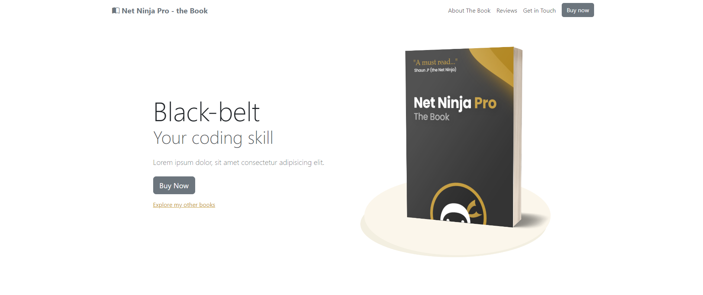
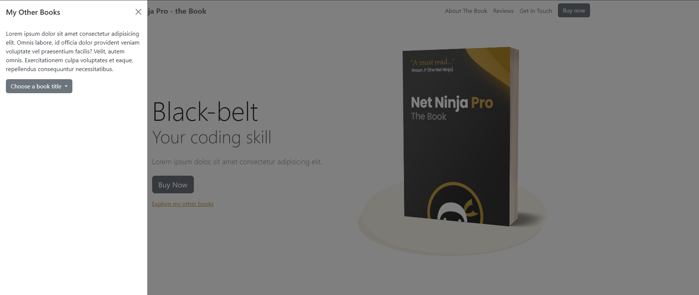
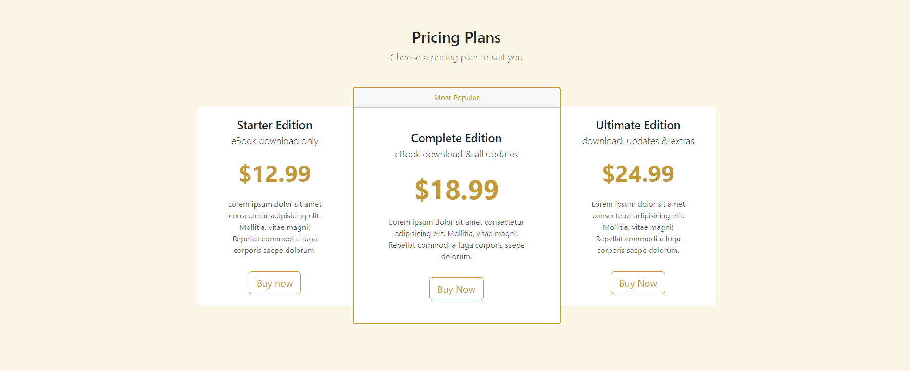
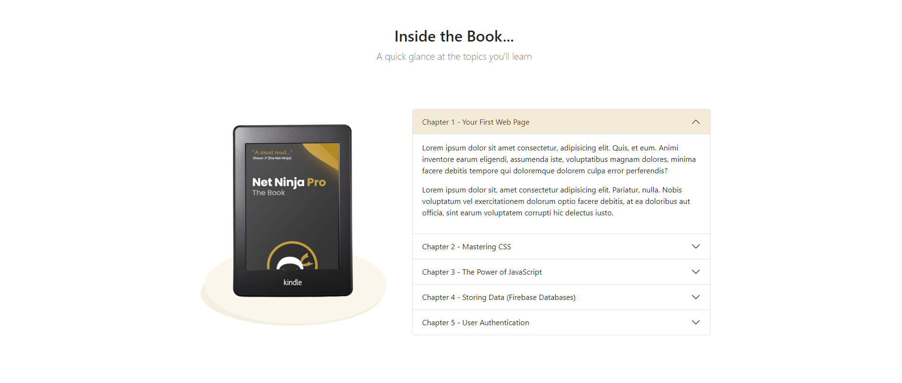
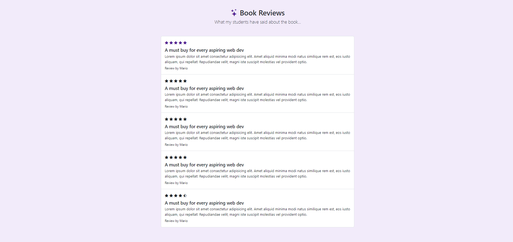
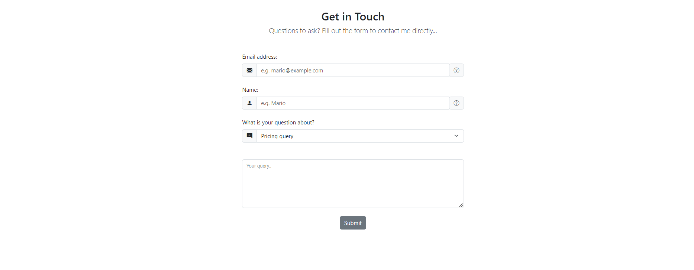
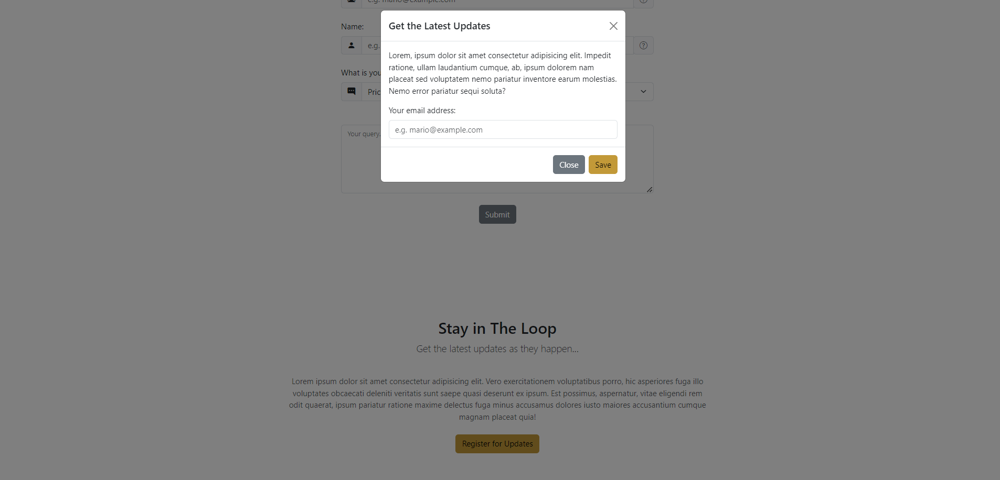

# BOOTSTRAP 5 WITH RESPONSIVE  

- This is my result learning Bootstrap from crash course   
- It used Responsive too
- Source: https://www.youtube.com/playlist?list=PL4cUxeGkcC9joIM91nLzd_qaH_AimmdAR
  
# Overview

- Home section  
    
- Sidebar  
    
- Pricing section  
    
- AboutBook section  
    
- Reviews section  
    
- GetInTouch section  
    
- GetUpdates section  
    
